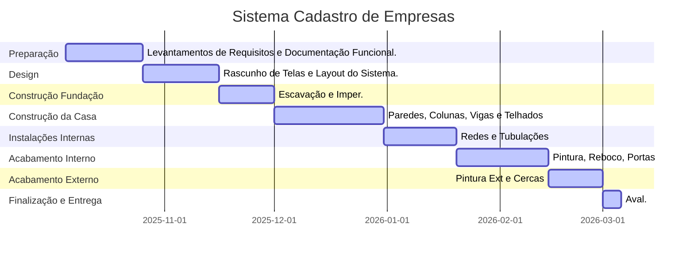

```mermaid
gantt
    title Sistema Cadastro de Empresas
    dateFormat YYYY-MM-DD

    section Preparação
    Levantamentos de Requisitos e Documentação Funcional. :active, a1, 2025-10-05, 21d

    section Design
    Rascunho de Telas e Layout do Sistema. :active, a2, after a1, 21d

    section Construção Fundação
    Escavação e Imper. :active, a3, after a2, 15d

    section Construção da Casa
    Paredes, Colunas, Vigas e Telhados :active, a4, after a3, 30d

    section Instalações Internas
    Redes e Tubulações :active, a5, after a4, 20d

    section Acabamento Interno
    Pintura, Reboco, Portas :active, a6, after a5, 25d

    section Acabamento Externo
    Pintura Ext e Cercas :active, a7, after a6, 15d

    section Finalização e Entrega
    Aval. :active, a8, after a7, 5d
```
