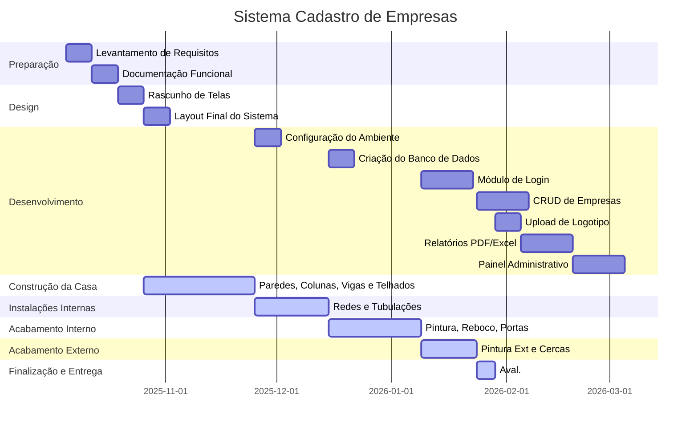

```mermaid
gantt
    title Sistema Cadastro de Empresas
    dateFormat YYYY-MM-DD

 section Preparação
    Levantamento de Requisitos          :a1, 2025-10-05, 7d
    Documentação Funcional              :a2, after a1, 7d

    section Design
    Rascunho de Telas                   :a3, after a2, 7d
    Layout Final do Sistema             :a4, after a3, 7d

    section Desenvolvimento
    Configuração do Ambiente            :a5, after a4, 7d
    Criação do Banco de Dados           :a6, after a5, 7d
    Módulo de Login                     :a7, after a6, 14d
    CRUD de Empresas                    :a8, after a7, 14d
    Upload de Logotipo                  :a9, after a8, 7d
    Relatórios PDF/Excel               :a10, after a9, 14d
    Painel Administrativo              :a11, after a10, 14d

    section Construção da Casa
    Paredes, Colunas, Vigas e Telhados :active, a4, after a3, 30d

    section Instalações Internas
    Redes e Tubulações :active, a5, after a4, 20d

    section Acabamento Interno
    Pintura, Reboco, Portas :active, a6, after a5, 25d

    section Acabamento Externo
    Pintura Ext e Cercas :active, a7, after a6, 15d

    section Finalização e Entrega
    Aval. :active, a8, after a7, 5d
```
