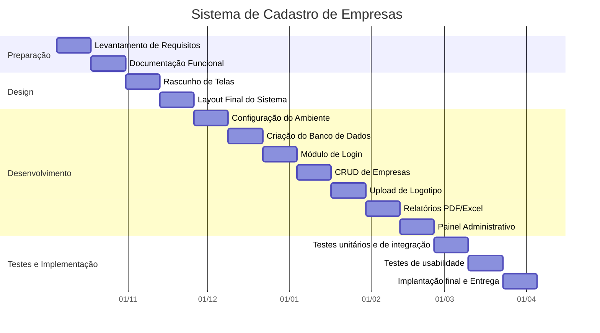

```mermaid
    gantt
    title Sistema de Cadastro de Empresas
    dateFormat  YYYY-MM-DD
    axisFormat  %d/%m

    section Preparação
    Levantamento de Requisitos       :a1, 2025-10-05, 13d
    Documentação Funcional           :a2, after a1, 13d

    section Design
    Rascunho de Telas                :a3, after a2, 13d
    Layout Final do Sistema          :a4, after a3, 13d

    section Desenvolvimento
    Configuração do Ambiente         :a5, after a4, 13d
    Criação do Banco de Dados        :a6, after a5, 13d
    Módulo de Login                  :a7, after a6, 13d
    CRUD de Empresas                 :a8, after a7, 13d
    Upload de Logotipo               :a9, after a8, 13d
    Relatórios PDF/Excel             :a10, after a9, 13d
    Painel Administrativo            :a11, after a10, 13d

    section Testes e Implementação
    Testes unitários e de integração     :a12, after a11, 13d 
    Testes de usabilidade                :a13, after a12, 13d
    Implantação final e Entrega          :a14, after a13, 13d 

```
