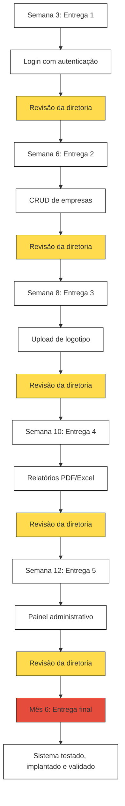

```mermaid
graph TD
  %% Entregas parciais Crystal Clear

  %% Entrega 1
  E1["Semana 3: Entrega 1"]:::branco --> F1["Login com autenticação"]:::branco
  F1 --> R1["Revisão da diretoria"]:::amarelo

  %% Entrega 2
  E2["Semana 6: Entrega 2"]:::branco --> F2["CRUD de empresas"]:::branco
  F2 --> R2["Revisão da diretoria"]:::amarelo

  %% Entrega 3
  E3["Semana 8: Entrega 3"]:::branco --> F3["Upload de logotipo"]:::branco
  F3 --> R3["Revisão da diretoria"]:::amarelo

  %% Entrega 4
  E4["Semana 10: Entrega 4"]:::branco --> F4["Relatórios PDF/Excel"]:::branco
  F4 --> R4["Revisão da diretoria"]:::amarelo

  %% Entrega 5
  E5["Semana 12: Entrega 5"]:::branco --> F5["Painel administrativo"]:::branco
  F5 --> R5["Revisão da diretoria"]:::amarelo

  %% Entrega final
  EF["Mês 6: Entrega final"]:::vermelho --> FF["Sistema testado, implantado e validado"]:::branco

  R1 --> E2
  R2 --> E3
  R3 --> E4
  R4 --> E5
  R5 --> EF

  classDef branco fill:#fff, stroke:#000, stroke-width:1px;
  classDef amarelo fill:#FFDB4D, stroke:#000, stroke-width:1px;
  classDef laranja fill:#FFA233, stroke:#000, stroke-width:1px;
  classDef vermelho fill:#E64C3C, stroke:#000, stroke-width:1px;


```

