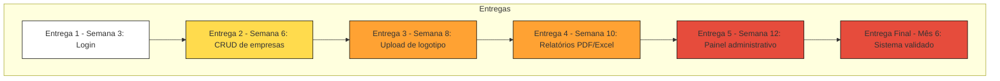

```mermaid
graph TD
  subgraph Entregas
    E1["Entrega 1 - Semana 3: Login"]:::branco
    E2["Entrega 2 - Semana 6: CRUD de empresas"]:::amarelo
    E3["Entrega 3 - Semana 8: Upload de logotipo"]:::laranja
    E4["Entrega 4 - Semana 10: Relatórios PDF/Excel"]:::laranja
    E5["Entrega 5 - Semana 12: Painel administrativo"]:::vermelho
    EF["Entrega Final - Mês 6: Sistema validado"]:::vermelho
  end

  E1 --> E2 --> E3 --> E4 --> E5 --> EF

  classDef branco fill:#fff, stroke:#000, stroke-width:1px;
  classDef amarelo fill:#FFDB4D, stroke:#000, stroke-width:1px;
  classDef laranja fill:#FFA233, stroke:#000, stroke-width:1px;
  classDef vermelho fill:#E64C3C, stroke:#000, stroke-width:1px;
```

