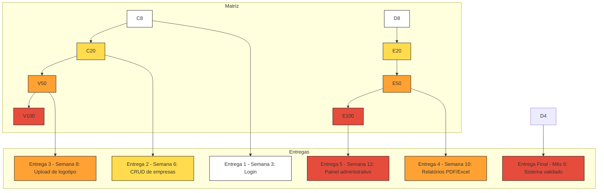

```mermaid
graph TD
  subgraph Matriz
    A1["C8"]:::branco --> A2["C20"]:::amarelo --> A3["V50"]:::laranja --> A4["V100"]:::vermelho
    B1["D8"]:::branco --> B2["E20"]:::amarelo --> B3["E50"]:::laranja --> B4["E100"]:::vermelho
  end

  subgraph Entregas
    E1["Entrega 1 - Semana 3: Login"]:::branco
    E2["Entrega 2 - Semana 6: CRUD de empresas"]:::amarelo
    E3["Entrega 3 - Semana 8: Upload de logotipo"]:::laranja
    E4["Entrega 4 - Semana 10: Relatórios PDF/Excel"]:::laranja
    E5["Entrega 5 - Semana 12: Painel administrativo"]:::vermelho
    EF["Entrega Final - Mês 6: Sistema validado"]:::vermelho
  end

  A1 --> E1
  A2 --> E2
  A3 --> E3
  B3 --> E4
  B4 --> E5
  D4 --> EF

  classDef branco fill:#fff, stroke:#000, stroke-width:1px;
  classDef amarelo fill:#FFDB4D, stroke:#000, stroke-width:1px;
  classDef laranja fill:#FFA233, stroke:#000, stroke-width:1px;
  classDef vermelho fill:#E64C3C, stroke:#000, stroke-width:1px;

```

